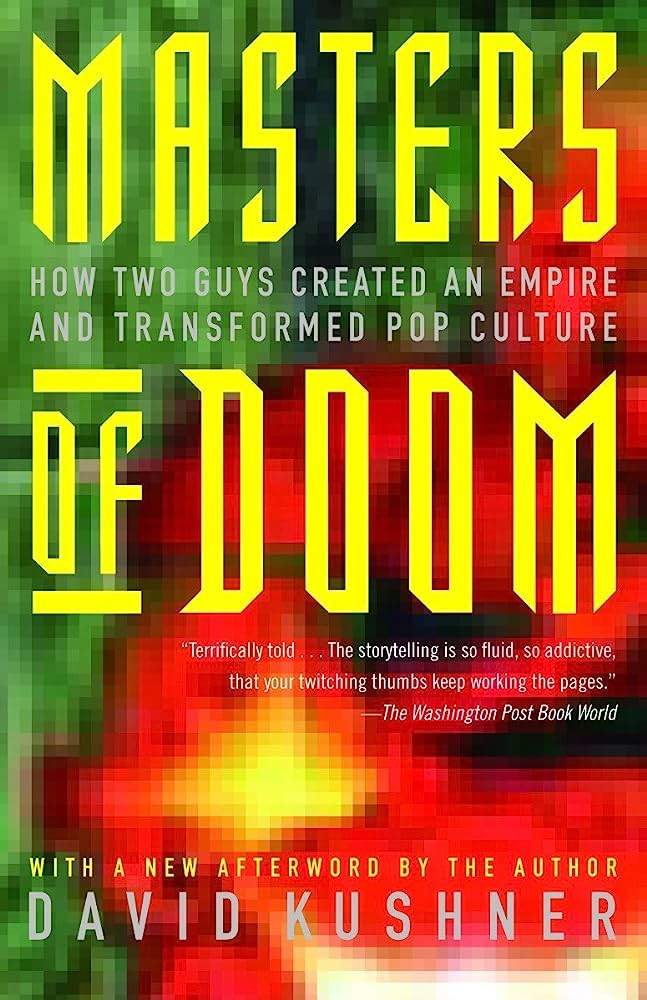
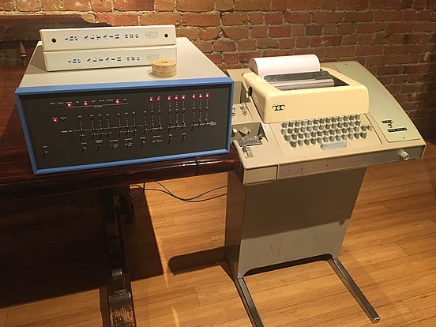
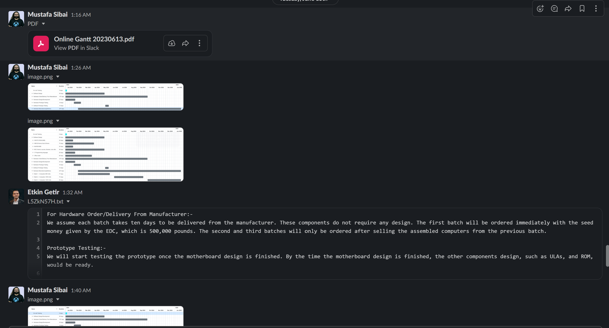
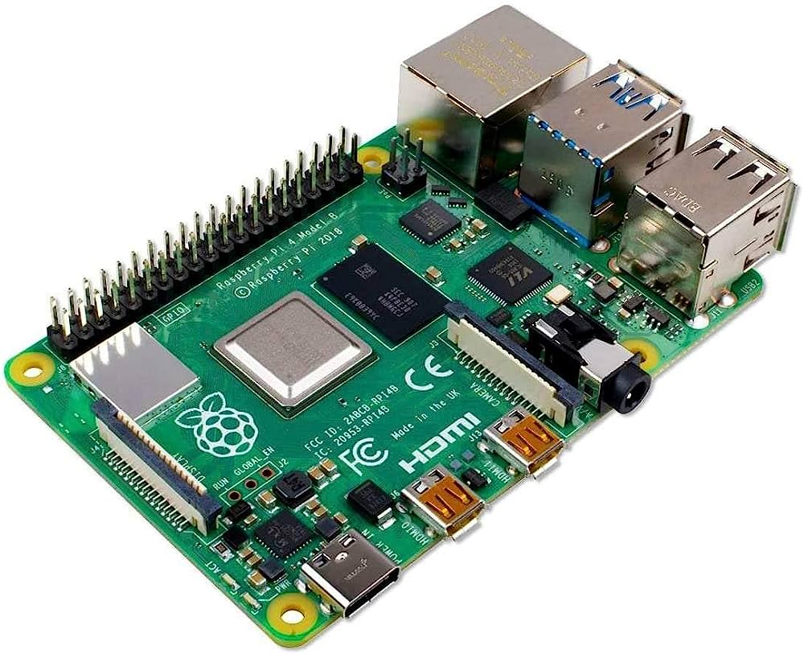
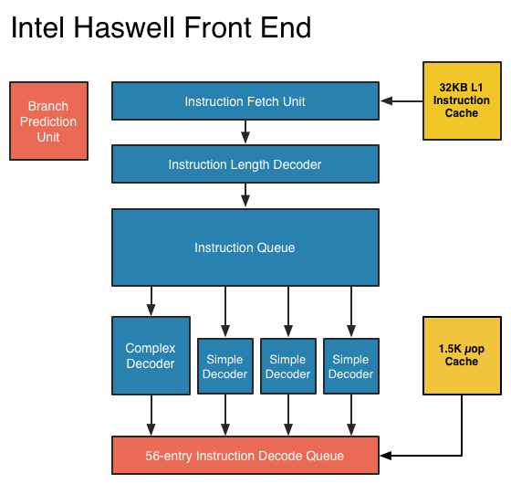

## WHAT

I went into this unit knowing that I already knew many of the topics that would be taught in this unit. I learned these topics from real work experiences as a freelance software engineer or part of a bigger tech organization. I wasn't very excited to start the unit, but I was pleasantly surprised. I think since I started my master's degree here at Essex, this is by far one of my favourite units. To start, the fact that the assignment was about creating a plan for designing and manufacturing a computer in the 1980s was right up my alley. There is nothing I love more than computer hardware design and architecture. Furthermore, the fact that the assignment was in the 1980s. A period of time that I wish I was alive to be able to tinker with computers from the very inception of computers was exciting, to say the least. To top it off, my professor for this unit worked on old hardware and systems, which I find extremely fascinating and exciting. Hearing stories about his time working on those old systems was fascinating. I never thought I would enjoy a unit more than this one. 

From the first week, after reading about the assignment, I wasted no time researching old computers manufactured in the early 80s. Learning every bit about the Altair computer(1975: Timeline of Computer History: Computer History Museum), Commodore 64 (Commodore 64), Apple 1 (Computer History Museum), and ZX Spectrum(Reliving the sinclair ZX spectrum 2022). I was blown away by the fact that not all of these computers could connect to a display. In fact, for some of these computers, you could only interact with them by flipping switches at the front panel and watching led lights turn on and off, indicating 1s and zeros. What really blew me away, though, is the fact that some of these computers could be connected to a teletype printer. After connecting the printer to the computer and loading the computer with a paper tab with the BASIC programming language (BASIC programming language: History, origin, and more 2023), the user would read the computer output from the printer—essentially using the printer as a monitor. When I saw this for the first time on the popular video site YouTube, my jaw dropped in disbelief or what I was seeing. I never imagined a world where a printer would be used in the place of a monitor. I thought that was the coolest thing ever.  

My research did not stop there. I kept reading about the invention of the BASIC programming language (BASIC programming language: History, origin, and more 2023). The invention of the first GUI-based operating system. How Microsoft created Windows and how in the old days, game developers had to write custom code to support certain audio cards. If the developer did not add support to specific audio cards in the game code, then the game would not have any sound. I also discovered "The Computer Chronicles", a show dedicated to showing the latest and greatest in computer advancements. Furthermore, I also discovered the book "Masters of Doom" which tells the story of "id Software", the computer game development company that made the popular Doom and Quake games. The book spoke about the lives of the two famous John Carmack and John Romero, the founders of id software and how they co-created id software. It spoke about the challenges these two guys faced while developing these video games.

Moreover, I learnt a lot about the 8080 CPU (CPU-world: Microprocessors / cpus) architecture, serial ports, and some of the old standards used for computers back, such as RS-232, RS-485 serial ports, and S100 bus. Most importantly, I learnt what goes into designing, manufacturing and delivering computers to the general public back in 1980. However, while all the above was new information to me, I already know some of the topics that were taught, like test-driven development, risk management, time estimation, Code quality and data structures. But I enjoyed reading about these topics again nonetheless. It was a good way to find gaps in my knowledge and plug them in. 

Our first assignment as a group was to design a computer from a list of hardware and software requirements given to us by our professor. We were also tasked to create a timeline, cost estimate, and justification for our choices. This was one of my all-time favourite assignments. Everyone on the team created an Excel sheet with their idea of what a good system would look like while considering the computer budget given to us in the brief. Once this step was done, all met and discussed the systems. I was in charge of ensuring that our chosen system was good. I combined everyone's best suggestions into one system that fit the budget. The rest of the team did the math and calculated the cost for testing, designing and manufacturing. Finally, I created our Gant chart for the project timeline. This assignment went really well, and I enjoyed it a ton. One of the issues we faced during the first assignment is some of the hardware pricing were incorrect. Also, there were one or two components missing which made the assignment a little more confusing than we were expecting. However, this was not a big problem since you will face similar issues in the real world working on a real project. This was an excellent way to give us an idea of the kind of obstacles that engineers face in the workplace worldwide.

For the second assignment, Etkin and I created the Python application while everyone on the team took care of the rest of the assignment. I wish I had participated more in this assignment. However, because I had to move apartments, my attention was not 100% on the assignment and Etkin and I only worked ont he Python app. Due to this, I only received a 54 out of 100% as a grade for my second assignment. If I wasn't distracted by the move, I think I would have helped my team more and could have received a better grade. I am honestly disappointed with this grade. I was genuinely hoping to receive a 65 at minimum.

## SO WHAT

Looking back at the first and second assignments, I think as a whole, we did really well as a team. I was placed with Aaron and Etkin for the second time. We've worked together on a project in the previous unit. I can honestly say that I have never worked with a better group than I have  for this unit. The guys have been absolutely fantastic and hard-working. Everyone communicated well on Slack, and everyone did their work on time. Once a week, we would all meet as a group to catch up and see what everyone has been up to. It worked really well, and as a whole, I think we did a great job. Both I and the team were really happy and energetic for the first assignment. However, for the second assignment, we were a little tired. 

Looking back at the second assignment, I think we could have done much better as a team. While we all as a team, made sure that the work was done on time and correctly, I think everyone was a little more busy than we were for the first assignment, and sadly, it did show in our grades. Nevertheless, I am really happy with the team and our work. Looking back at the unit learning outcomes, I am very happy with what I have learnt for this unit. I reinforced my existing knowledge on SDLC, project management, Gant charts, Timelines, task breakdown, waterfall and agile methodologies, risk management, and project delivery.

In addition, these two assignments have been an excellent guide in helping me research my thesis project. As mentioned in my previous reflections, I want to create an operating system from scratch on the ARM CPU architecture. This unit has helped me plan my project timeline better. Furthermore, it allowed me to put a risk management plan and contingencies of things that could go wrong and how to solve them. Things like what would I do if my Rasberypi ARM-based computer dies? How can I continue working on my project without it. Or what if my code was corrupted and deleted? What would I do in that case? or What if I find out halfway through making the operating system that I will not have enough time to finish writing the OS in time to submit my thesis? Using the risk management skills I have learnt in this unit helped me plan for all of these. I have also created a Gant chart detailing when I should be able to finish writing my OS code. I have created multiple milestones that I should be able to hit easily. I will know ahead of time if I am falling behind schedule by seeing that I have not met one or more of these milestones.

## Now what:
Moving forward, I can use all the information I have learnt in this unit to successfully design and deliver a project on time. Topics such as test-driven development, task breakdown, Gant charts, project management methodologies, and risk management plans will aid me in my future career.

One of the topics that I want to dive deep into is hardware architecture and how bad software can hurt the performance of computers. One of the biggest problems in todays programming world is that there are so many abstraction layers between the programmer and the computer that most people don't bother to learn or understand what the computer does with their code. As in what is really the computer doing with this code in terms of cache, registers, memory allocation etc... What is the ALU doing when they are multiplying a 4x4 matrix with a vector 4? are they taking advantage of SIMD (SIMD - UC santa barbara) operations? Is their code cache coherent? Is their code erasing ten years worth of hardware advancement because of how unoptimized it is? These are all important questions that programmers today should know and understand. I know most programmers are more worried about how their HTML div is not centred on the screen or how their CSS is rendering the wrong colour. While these are important, it is even more important to understand how the V8 Chrome engine renders things on the screen and how the CPU behaves when rendering HTML on the screen using the V8 engine. Most programmers nowadays just go and copy and paste code or download a library to do a simple task like doing a shadow copy or deep copy or use AI such as ChatGPT to write their code for them, but they must understand that if they want to create a good performant software they need to understand the computer hardware architecture. Programmers back in the 1980s had no choice but to learn hardware architecture because they were programming so close to the machine's CPU. There were not many if any, abstraction layers between them and the computer. The programmers had to allocate memory, move pointers around, do DMA requests, and tell the CPU using BAISC or Assembly what to do. Nowadays, that is not really possible. Writing code on bare metal is close to impossible unless you know exactly what you are doing or have accumulated 30 years' worth of knowledge. However, that doesn't mean that programmers should not know or understand what their programs are doing on the CPU and Memory.

This is my next topic of research. I want to dive deep into x86, ARM, and RISC architecture. I would like to understand them in and out. However, one of the things that is currently stopping me from pursuing this is the fact that I am currently doing two full-time jobs and doing my master's degree at the same time. However, I need to find time to learn all of this and dive deep into it. The other thing that I would like to learn is GPU architecture since, nowadays, Nvidia and AMD are creating GPUs with AI-based capabilities (GDC 2023 - the fidelityfx™ SDK 2023). Since AI is the future, this is a topic that I would like to learn more about.

## Referances:

1975: Timeline of Computer History: Computer History Museum (no date) 1975 | Timeline of Computer History | Computer History Museum. Available at: https://www.computerhistory.org/timeline/1975/ (Accessed: 25 July 2023). 

Commodore 64 (no date) Impact of the Commodore 64 : a 25th anniversary celebration, lecture by Adam Chowaniec et al. | 102695068 | Computer History Museum. Available at: https://www.computerhistory.org/collections/catalog/102695068 (Accessed: 25 July 2023). 

Vintagecomputer.net classic computing and Vintage Computer Restoration Projects (no date) Vintagecomputer.net Classic Computing and Vintage Computer Restoration Projects. Available at: https://www.vintagecomputer.net/ (Accessed: 25 July 2023). 

Computer History Museum (no date) Apple-1. Available at: https://www.computerhistory.org/revolution/personal-computers/17/312/1132 (Accessed: 25 July 2023). 

Person (2022) Reliving the sinclair ZX spectrum, BCS. Available at: https://www.bcs.org/articles-opinion-and-research/reliving-the-sinclair-zx-spectrum/ (Accessed: 25 July 2023). 

Abby (2023) BASIC programming language: History, origin, and more, History. Available at: https://history-computer.com/basic-programming-language-guide/ (Accessed: 25 July 2023). 

(No date) CPU-world: Microprocessors / cpus. Available at: https://www.cpu-world.com/CPUs/CPU.html (Accessed: 24 July 2023). 

(No date a) SIMD - UC santa barbara. Available at: https://sites.cs.ucsb.edu/~tyang/class/240a17/slides/SIMD.pdf (Accessed: 24 July 2023). 

GDC 2023 - the fidelityfxTM SDK (2023) YouTube. Available at: https://www.youtube.com/watch?v=YOvYsEVkFXE&amp;ab_channel=AMD (Accessed: 25 July 2023). 